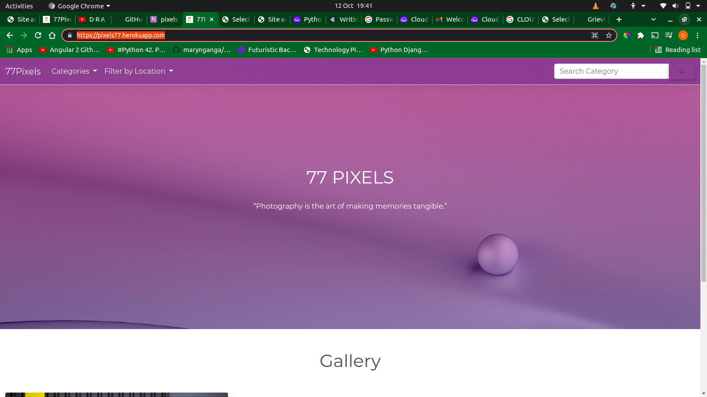
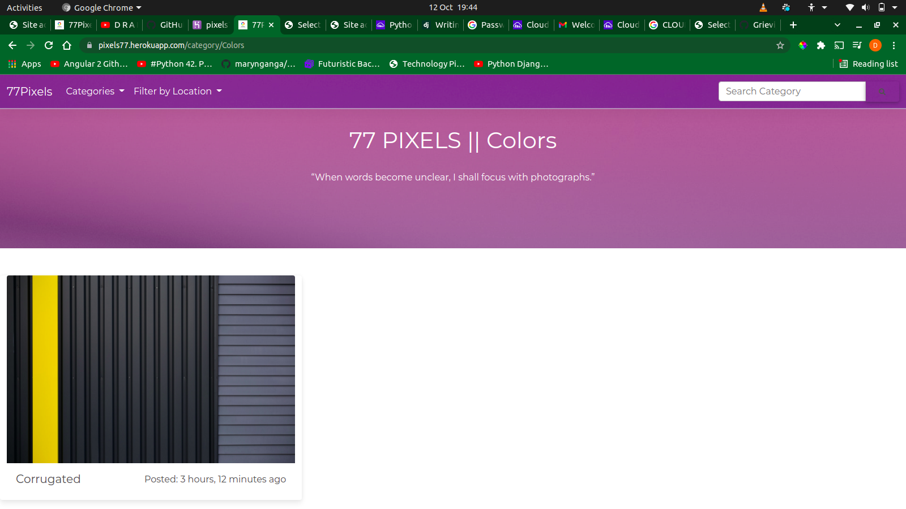
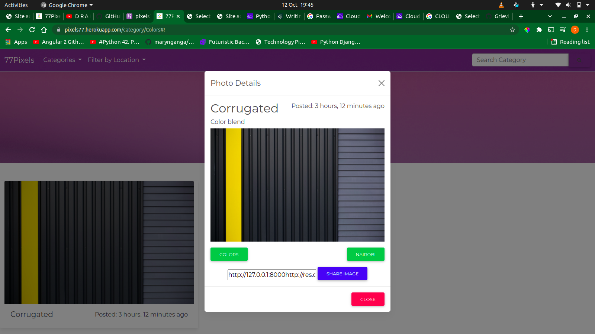

# 77PIXELS

## By [Derrick Cheboi](https://github.com/CheboiDerrick/)

## Description
77Pixels is an online photo gallery application that show cases amazing pictures from different places. The pictures are uploaded with categories and locations they were taken.
## Application Behaviour
These are the behaviours/features that the application implements for use by a user.

A user should be able to:
* Provide the user with all pictures uploaded on the homepage
* Redirect a user to the pictures of a particular category or location
* Provide the details of a picture in a modal when clicked on.

## Screenshots
* Home Page

* Categories

* Location

* Picture details

## SetUp / Installation Requirements
### Prerequisites
* python3.8
* pip3
* pipenv
* Git and Github

### Cloning
* In your terminal:
        
        $ git clone https://github.com/CheboiDerrick/my-gallery-django.git
        $ cd my-gallery-django

## Running the Application
* Install all dependencies by running 

      $ pipenv install

* Set up your database and add it to the settings in the photogallery  project folder
* To run the application, in your terminal:
        
        $ python manage.py runserver

* Open your browser and navigate to http://localhost:8000 to view the web app

        
## Technologies and Languages Used
* Python -(3.8)
* Django

## License
[MIT](https://github.com/CheboiDerrick/my-gallery-django/blob/main/LICENSE) 

&copy;2021